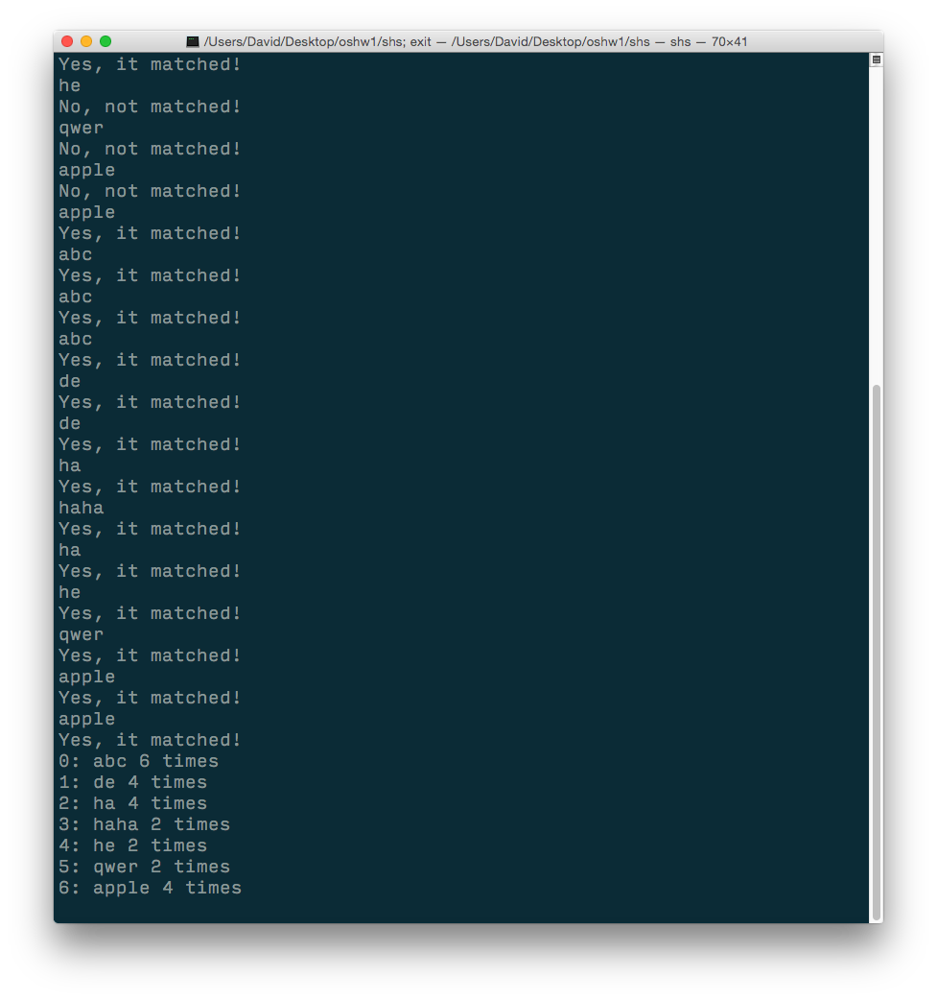
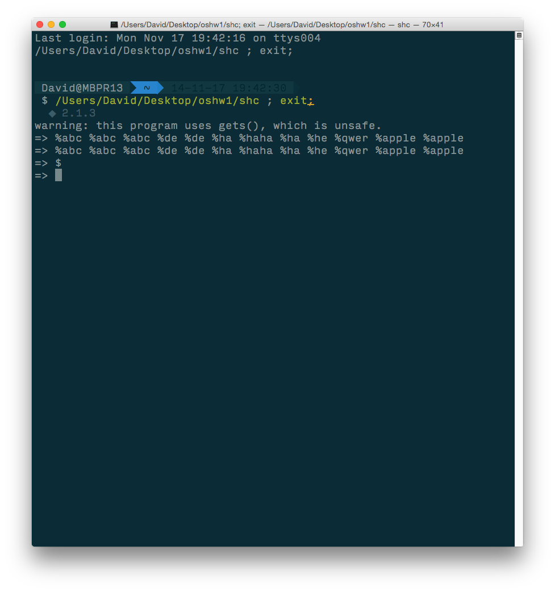

# OSHW1
## Shared memory using POSIX API
##Screenshot
###Server side

###Client side

##Instruction
### Build
	gcc shm_client.c -o shc && gcc shm_server.c -o shs
### Run
	./shc && ./ shs

###Client side
If you want to add a data "apple", you need to input %apple.

% is to store.

	=> %apple
If you want to print out all data you stored in server, use '$'.

	=> $
	
###Server side
Server is where you show your data and show if the input data exist or not.

##How does it work?
I use POSIX API. Is it avaible in windows?

No. 

POSIX is a Unix based api.

Mac is your good friend. Do it on Mac!

###Just copy this code, put it in your main.

	key_t shmKey;
    int shmId;
    int size = 20;
    pid_t pid;
    char *word;

    // ftok take two params, and return a key_t.
    // key_t =  ftok(const char *pathname, int proj_id);
    if ((shmKey = ftok(".",'a')) == (key_t) - 1)
    {
        printf("key generate error\n");
        exit(1);
    }

    if ((shmId = shmget(shmKey, size, IPC_CREAT | 0600)) < 0)
    {
        printf("error create shared memory: %d\n", shmId);
        exit(1);
    }

    if ((word = (char*)shmat(shmId, NULL, 0)) == (char *) -1)
    {
        printf("shmat error\n");
        exit(1);
    }
###Include these.

	#include <stdio.h>
	#include <stdlib.h>
	#include <sys/ipc.h>
	#include <sys/shm.h>
	//shm_open include
	#include <sys/mman.h>
	#include <sys/stat.h>        /* For mode constants */
	#include <fcntl.h> 
	//ftruncate include
	#include <unistd.h>
	#include <sys/types.h>
###Now, your variables `*word` in server and client are connected.